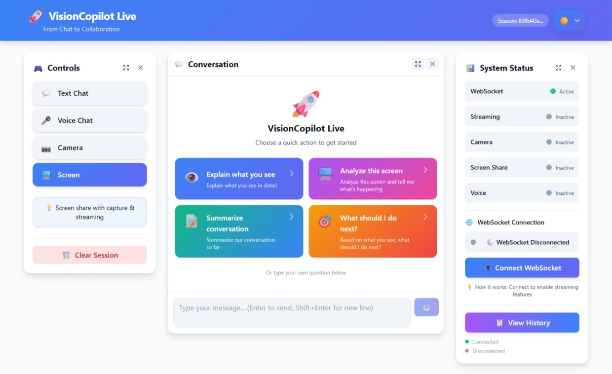

# VisionCopilot Live

🚀 **VisionCopilot Live is a real-time multimodal AI copilot that can see your screen, hear your voice, and collaborate with you interactively.**

Unlike traditional AI assistants that rely only on typed prompts, VisionCopilot enables **natural human-AI collaboration** by combining:

🎤 Voice interaction  
👁 Visual understanding (screen or camera)  
🧠 Multimodal reasoning  

Powered by **Gemini**, VisionCopilot transforms AI from a passive chatbot into an **active real-time collaborator**.

Built for the **Gemini Live Agent Challenge**.

> **From Chat → To Collaboration**

------------------------------------------------------------------------

# ✨ Demo

VisionCopilot Live enables powerful real-time AI interaction:

• Voice conversations with AI\
• Camera and screen understanding\
• Real-time multimodal reasoning\
• Session memory and summaries\
• Interactive quick-action prompts




## 🎬 Demo Videos

Watch VisionCopilot Live in action:

**Main Demo (short)**  
[](docs/demo_video_main.mp4)

**Extended Demo (full features)**  
[](docs/demo_video_extended.mp4)


> Note: Click the thumbnails to play the videos directly from GitHub.

The demo shows how VisionCopilot:

• Hears voice input  
• Sees screen context  
• Analyzes visual information  
• Provides real-time AI guidance

------------------------------------------------------------------------

# � Interface Preview

| Voice Interaction | Screen Analysis | AI Response |
|------------------|----------------|-------------|
|  |  |  |

------------------------------------------------------------------------

# �💡 What Makes VisionCopilot Different

VisionCopilot introduces a **multimodal AI interaction model**.

Traditional AI:
Text → AI → Response

VisionCopilot:
Voice + Vision → AI Reasoning → Real-Time Collaboration

This allows AI to understand **both what the user says and what the user sees**, enabling powerful assistance in real-world workflows.

------------------------------------------------------------------------

# 🚀 Key Features

## Multimodal AI Interaction

Interact with AI using voice, screen sharing, or webcam input.

## Real-Time Streaming Analysis

VisionCopilot processes visual input and responds instantly using
WebSockets.

## AI Copilot Personality

VisionCopilot behaves as a collaborative assistant that explains visual
context and provides guidance.

## Quick Action Prompts

One-click triggers for AI workflows:

• Explain what you see\
• Analyze this screen\
• Summarize the conversation\
• What should I do next?

## Smart Session Summary

Generate structured summaries:

• Key topics discussed\
• Important findings\
• Decisions made\
• Open questions\
• Action items

## Live System Status

Indicators show:

• WebSocket connection status\
• Camera activity\
• Voice input status\
• Streaming state

------------------------------------------------------------------------

# 🏗 System Architecture

VisionCopilot Live follows a **three-layer architecture**.


## Frontend Layer

Interactive user experience:

• Microphone input\
• Screen sharing\
• Webcam streaming\
• Real-time chat interface\
• Quick-action controls

Technologies:React,TypeScript,TailwindCSS,WebRTC,MediaStream API,Web Speech API

------------------------------------------------------------------------

## Backend Layer

Orchestrates AI interaction and real-time communication:

• WebSocket communication\
• Session management\
• Streaming visual analysis\
• Gemini API integration

Technologies: Python, FastAPI, WebSockets, REST APIs

------------------------------------------------------------------------

## AI Layer

Gemini-powered multimodal reasoning:

• Multimodal prompt processing\
• Conversational reasoning\
• Vision analysis\
• Session summarization

------------------------------------------------------------------------


# 🧠 Technology Stack

| Layer / Category        | Technologies                              |
|-------------------------|-------------------------------------------|
| Languages               | Python, TypeScript, JavaScript, HTML5, CSS3 |
| Frontend                | React, TailwindCSS, WebRTC, Web Speech API |
| Backend                 | FastAPI, WebSockets, REST APIs            |
| AI                      | Gemini, Google GenAI SDK                  |
| Cloud & Infrastructure  | Google Cloud, Cloud Run, Docker           |
| Development Tools       | Git, GitHub                               |------------------------------------------------------------------------

## Project Structure

```
visioncopilot-live/
│
├── frontend/
│   ├── public/
│   ├── src/
│   │   ├── components/
│   │   │   ├── CameraView.tsx
│   │   │   ├── VoiceInput.tsx
│   │   │   └── ResponsePanel.tsx
│   │   │
│   │   ├── services/
│   │   │   └── websocket.ts
│   │   │
│   │   ├── App.tsx
│   │   └── main.tsx
│   │
│   └── package.json
│
├── backend/
│   ├── app/
│   │   ├── main.py
│   │   ├── routes.py
│   │   ├── websocket.py
│   │   ├── vision.py
│   │   └── gemini_agent.py
│   │
│   └── requirements.txt
│
├── ai/
│   └── prompts/
│       └── agent_prompt.txt
│
├── infrastructure/
│   ├── Dockerfile
│   └── deploy.sh
│
├── docs/
│   └── architecture.png
│
├── .gitignore
└── README.md
```

---

------------------------------------------------------------------------

# 🔐 Environment Setup

## Backend Configuration (Required)

1. Navigate to the backend directory:
   ```bash
   cd backend
   ```

2. Copy the environment template:
   ```bash
   cp .env.example .env
   ```

3. Edit `.env` and add your Gemini API key:
   ```bash
   GEMINI_API_KEY=your_actual_api_key_here
   ```
   
   Get your free API key from: [Google AI Studio](https://makersuite.google.com/app/apikey)

## Frontend Configuration (Optional)

The frontend uses sensible defaults. Only create a `.env` file if you need custom backend URLs:

```bash
cd frontend
cp .env.example .env
# Edit .env if needed (typically not required for local development)
```

**⚠️ Security Note:** Never commit `.env` files to version control. See [SECURITY.md](SECURITY.md) for detailed security guidelines.

---

# ⚙ Running Locally

## 1️⃣ Clone the repository

```bash
git clone https://github.com/moazizbera/visioncopilot-live
cd visioncopilot-live
```

## 2️⃣ Backend Setup

```bash
# Navigate to backend directory
cd backend

# Create virtual environment (recommended)
python -m venv venv
source venv/bin/activate  # On Windows: venv\Scripts\activate

# Install dependencies
pip install -r requirements.txt

# Configure environment (see Environment Setup above)
cp .env.example .env
# Edit .env and add your GEMINI_API_KEY
```

## 3️⃣ Start backend server

```bash
# Make sure you're in the backend directory
cd backend

# Start with uvicorn
uvicorn app.main:app --reload --host 0.0.0.0 --port 8000
```

Backend will be available at: `http://localhost:8000`

## 4️⃣ Frontend Setup

```bash
# In a new terminal, navigate to frontend directory
cd frontend

# Install dependencies
npm install
```

## 5️⃣ Start frontend

```bash
npm run dev
```

Frontend will be available at: `http://localhost:5173`

------------------------------------------------------------------------

# 🔄 Example Workflow

1 User shares screen or activates camera\
2 VisionCopilot analyzes visual content\
3 AI explains what is happening in real time\
4 User asks follow-up questions using voice or chat\
5 AI generates structured session summaries

------------------------------------------------------------------------

# 💡 Use Cases

• Code debugging and software development\
• Document understanding and analysis\
• Learning and tutoring\
• Workflow assistance\
• Visual explanation of complex content

------------------------------------------------------------------------

# ⚙ Technical Challenges

• Low-latency multimodal streaming\
• Synchronizing voice and visual inputs\
• Managing session memory across WebSockets\
• Designing effective prompts for multimodal reasoning

------------------------------------------------------------------------

# 🔮 Future Improvements

Planned enhancements include:

• persistent AI memory\
• autonomous AI agents\
• tool-use capabilities\
• UI automation features\
• enterprise integrations

------------------------------------------------------------------------

# � Security

- **See [SECURITY.md](SECURITY.md)** for guidelines
- **Never commit `.env` files** with API keys
- **Rotate keys** if exposed
- **Use environment variables** for all sensitive configs

------------------------------------------------------------------------

# �📄 License

MIT License

------------------------------------------------------------------------

# 🙏 Acknowledgments

Created for the **Gemini Live Agent Challenge** 
Thanks to the Gemini platform for enabling advanced multimodal reasoning.
